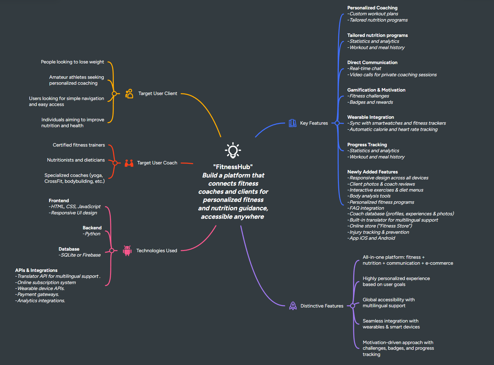

# 0. Team Formation
## Initial Meeting

We held our first team meeting to introduce ourselves, share our backgrounds, strengths, and interests, and discuss how we would collaborate throughout the project. The meeting allowed us to better understand each member’s skill set and define a clear structure for working together.
## Team Members and Initial Roles

| Name                                               | Role                  | Strenghts/Skills                                       |
|----------------------------------------------------|-----------------------|--------------------------------------------------------|
|[Evgeni Khalepo](https://github.com/Genia888)       | Front developer       | HTML, CSS, JavaScript, task coordination               |
|[Elhadj Reziga](https://github.com/hedjouj)         |Front developer        | HTML, CSS, JavaScript, communication                   |
|[Sébastien Salgues](https://github.com/SebSa12000)  | Backend developer     | Python, SQLite, testing, debugging, documentation      |

## Team Norms for Collaboration
- Communication Tools : Slack, Discord, Trello
- Meeting Schedule : on first phase of project every monday and thursday at 10AM and on seconde phase every day at 10AM.
- Decision-Making Process : Open team discussions to share perspectives
 ## Summary
 By establishing these roles, tools, and collaboration strategies early, we ensure clear communication, efficient teamwork, and smooth coordination throughout the project lifecycle.

# 1. Research and Brainstorming
## Individual and Group Research

Each team member conducted initial research to identify potential project opportunities. We explored :
- Real-world problems such as lack of affordable access to fitness and nutrition guidance.
- Industry trends like the growth of digital health, fitness apps, and remote coaching platforms.
- Innovative solutions in mobile technology, wearable integration, and AI-driven personalization.

This research highlighted the increasing demand for accessible, personalized health and fitness solutions, inspiring us to generate ideas around digital platforms for wellness.

## Brainstorming Session
We created a mind map centered on the theme health and fitness solution.
 [Mind Mapping](https://mm.tt/map/3802122130?t=KvdiA52QPg)

# 2. Idea Evaluation
- Create a website/mobile to communicate between coach and users
- The user can choose a coach from sport and nutrition
- The user can see on his app the training menu and nutrition menu of the day
- Fitness Hub can sell goodies to user
- The user pay an abonnement to get the training of the coach
 
| **Idea**                        | **Feasibility** | **Impact** | **Technical Alignment** | **Scalability** |
| ------------------------------- | --------------- | ---------- | ----------------------- | --------------- |
| Personalized fitness programs   | 9/10            | 10/10      | 8/10                    | 9/10            |
| Online nutrition tracking            | 8/10            | 9/10       | 8/10                    | 8/10            |
| Real-time chat                  | 6/10            | 7/10       | 6/10                    | 9/10            |
| Integrated multilingual support | 7/10            | 7/10       | 8/10                    | 8/10            |
| Online store                    | 6/10            | 8/10       | 8/10                    | 9/10            |
| Badges and rewards              | 5/10            | 8/10       | 7/10                    | 9/10            |
| FAQ integration                 | 7/10            | 5/10       | 7/10                    | 9/10            |
| Online subscription system      | 6/10            | 8/10       | 7/10                    | 9/10            |
| Video calls for private coaching sessions| 6/10            | 8/10       | 7/10                    | 9/10            |
| Responsive design across all devices| 6/10        | 8/10       | 7/10                    | 9/10            |
| Client photos & coach reviews   | 6/10            | 8/10       | 7/10                    | 9/10            |
| Body analysis tools             | 6/10            | 7/10       | 6/10                    | 9/10            |
| Coach database                  | 7/10            | 8/10       | 7/10                    | 7/10            |
| Web site                        | 9/10            | 10/10      | 10/10                   | 10/10           |
| App mobile iOS and Android      | 1/10            | 7/10       | 6/10                    | 9/10            |
| Workout and meal history        | 7/10            | 8/10       | 7/10                    | 7/10            |
| Payment gateways                | 7/10            | 7/10       | 8/10                    | 8/10            |

# 3. Decision and Refinement  

## Selected MVP  
**FitnessHub – Platform connecting fitness coaches and clients**  

## Main Objective  
Develop an intuitive web platform that connects fitness coaches, nutritionists, and nutritionitians with users seeking personalized guidance (fitness programs + nutrition) accessible from anywhere.  

## MVP Description  
For the MVP, we aim to build a simplified version of the platform that includes:  
- A client area to create a profile, set goals (weight loss, performance, wellness, etc.), and track progress.  
- A coach area with detailed profiles (experience, specialization, photos) and the ability to provide personalized programs.  
- A basic communication system (real-time chat or integrated messaging).  
- A simple progress tracking module (basic statistics: calories, completed sessions, progression).  

## Problem It Solves  
- Difficulty finding the right coach (fitness/nutrition) in a simple, centralized way.  
- Lack of accessible tools to clearly track progress.  
- Limited personalization in existing online programs.  

## Target Users  
**Clients:**  
- Individuals looking to lose weight or improve their health.  
- Amateur athletes seeking structured support.  
- Users looking for simple, easy-to-use solutions.  

**Coaches:**  
- Certified fitness trainers.  
- Nutritionists and nutritionitians.  
- Specialized coaches (yoga, CrossFit, bodybuilding, etc.).  

## Key Features (MVP)  
- Profile creation (clients and coaches).  
- Personalized programs based on goals.  
- Direct messaging (chat or integrated system).  
- Progress tracking (calories, sessions, weight, objectives).  
- Simple and responsive interface.  

## Expected Outcomes  
- Allow users to quickly find the right coach for their needs.  
- Provide coaches with a platform to grow their client base.  
- Build an initial community around fitness and nutrition.  
- Validate the relevance of the approach before adding advanced features (wearable integration, gamification, e-commerce).  
# 0. Team Formation
## Initial Meeting

We held our first team meeting to introduce ourselves, share our backgrounds, strengths, and interests, and discuss how we would collaborate throughout the project. The meeting allowed us to better understand each member’s skill set and define a clear structure for working together.
## Team Members and Initial Roles

| Name | Role       | Strenghts/Skills          |
|--------|------------------|----------------------|
|[Evgeni Khalepo](https://github.com/Genia888) | Front developer       | HTML, CSS, JavaScript, task coordination        |
|[Elhadj Reziga](https://github.com/hedjouj)  |Front developer | HTML, CSS, JavaScript, communication   |
|[Sébastien Salgues](https://github.com/SebSa12000)  | Backend developer    | Python, SQLite, testing, debugging, documentation       |

## Team Norms for Collaboration
- Communication Tools : Slack, Discord, Trelo
- Meeting Schedule : on first phase of project every monday and thursday at 10AM and on seconde phase every day at 10AM.
- Decision-Making Process : Open team discussions to share perspectives
 ## Summary
 By establishing these roles, tools, and collaboration strategies early, we ensure clear communication, efficient teamwork, and smooth coordination throughout the project lifecycle.

# 1. Research and Brainstorming
Create a fitness website/mobile between coach/diet and users

# 2. Idea Evaluation
- Create a website/mobile to communicate between coach and users
- The user can choose a coach from sport and diet
- The user can see on his app the training menu and diet menu of the day
- Fitness Hub can sell goodies to user
- The user pay an abonnement to get the training of the coach

# 3.
