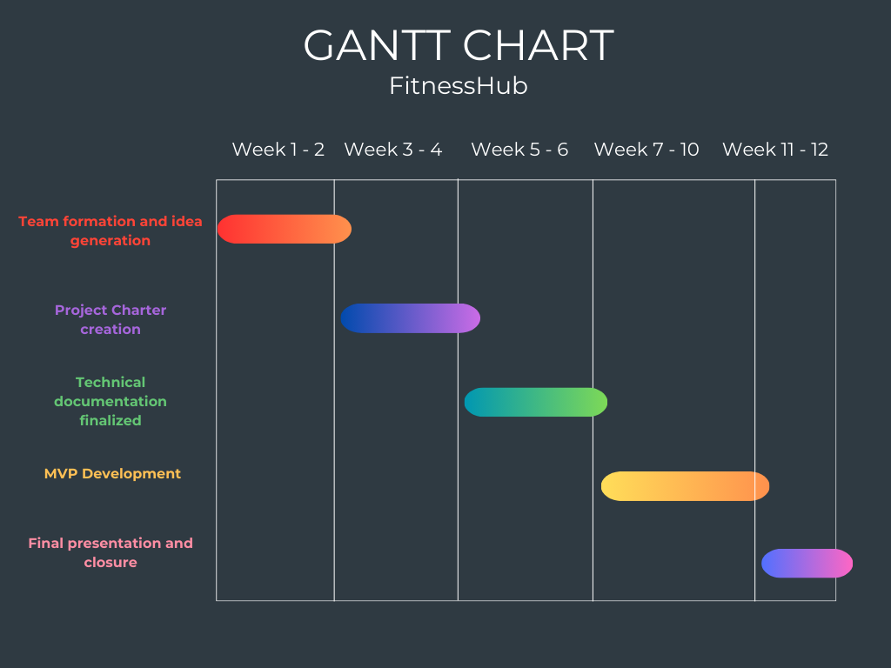

# 0. Define Project Objectives
The purpose of FitnessHub is to develop a digital platform that connects fitness coaches and clients, offering personalized fitness and nutrition guidance. The app aims to make professional coaching more accessible, provide all-in-one features, and encourage users to achieve their health goals effectively.
### SMART Objectives
We created a mind map SMART [Mind Mapping](https://mm.tt/map/3808942400?t=xMeTVXewLk)

# 1. Identify Stakeholders and Team Roles
### Stakeholders
| **Stakeholder type**                             | **Name**        | **Description** | **Role/Interest in the project**   | **Influence** |
| --------------------------------------------|-----------------| ----------------| -----------------------------------|---------------|
| Internal                                    |Evgeni           |Team member      |Responsible for frontend development|    ★★★★★    |
| Internal                                    |Sebastien        |Team member      |Responsible for backenddevelopment  |    ★★★★★    |
| Internal                                    |Elhadj           |Team member      | Responsible for frontend development | ★★★★★     |
| Internal | Holberton Instructors & Reviewers      | Instructors     | Evaluate deliverables and give advices/reviews   |★★★★☆      |
| External                    | Other Holberton students      | Potential end users      | Give feedback, reviews, advices | ★★★☆☆   |

### Team Roles

| **Role**                  | **Assigned To**     | **Responsibilities**                                                                 |
| --------------------- | --------------- | -------------------------------------------------------------------------------- |
| Team lead / Project Manager       | Evgeni          | Organize timeline, ensures coordination and ensure the plan is respected              |
| Team lead / Frontend Developer    | Evgeni / Elhadj | Develop the frontend, make sure every features work, make report to the backend developer if needed   |
| Team lead / Backend Developer     | Sebastien       | Develop the backend, make sure It is link correctly with the website          |

# 2. Define Scope

| **In-scope**                                  | **Out-of-scope**                          |
|-----------------------------------------------|-------------------------------------------|
|User inscription + forms (height, weight, age…)| Body analysis tools                       |
|Development of a website (fonctional)          |App mobile                                 |
|Link back end with the website                 |Payment gateway                            |
|Database with a list of exercises              |Videos calls for private coaching          |
|Web frontend                                   |Online subscription                        |
|List of Coaches (prototypes + photos)          |Badges & rewards                           |
|Nutrition section                              |Realtime chat                              |
|List of workout                                |Online diet tracking                       |

# 3. Identify Risks
| **Risk**                                             |  **Mitigation Strategy**                                 |
| ---------------------------------------------------- | -------------------------------------------------------- |
| Team members don’t know all the tools                | Plan short tutorials and learn together at the start     |
| Project timeline is short (12 weeks)                 | Focus only on MVP core features and avoid adding extras  |
| Miscommunication in the team                         | Use Slack/Discord and have weekly meetings               |
| Data privacy (user health and chat data)             | Use secure login, encrypt data, and follow privacy rules |
| Integration challenges (chat, video, gamification)   | Start with proven APIs/libraries, test early integrations, and avoid over-customization in MVP |
| Bugs or technical problems                           | Test regularly and keep some buffer time for debugging   |

# 4. Develop a High-Level Plan
We created a Gantt chart showing the project plan

*Click for more details*

<strong>Week 1-2:</strong> Team Formation and Idea Development

- Brainstorming
- Idea selection

- Documentation

<strong>Week 3-4:</strong> Project Charter creation

- Project Objectives  
- Stakeholders and Roles  
- Scope  
- Risks  
- High-Level Plan  
- Documentation

<strong>Week 5-6:</strong> Technical Documentation

- High-Level Package Diagram  
- Detailed Class Diagram for Business Logic Layer  
- Sequence Diagrams for API Calls  
- Documentation  

<strong>Week 7-10:</strong> MVP Development & Execution

- Business Logic and API Endpoints  
- Backend with Authentication and Database Integration  
- Front-end (UI)  

<strong>Week 11-12</strong>: Final presentation and closure

- Project Closure  

