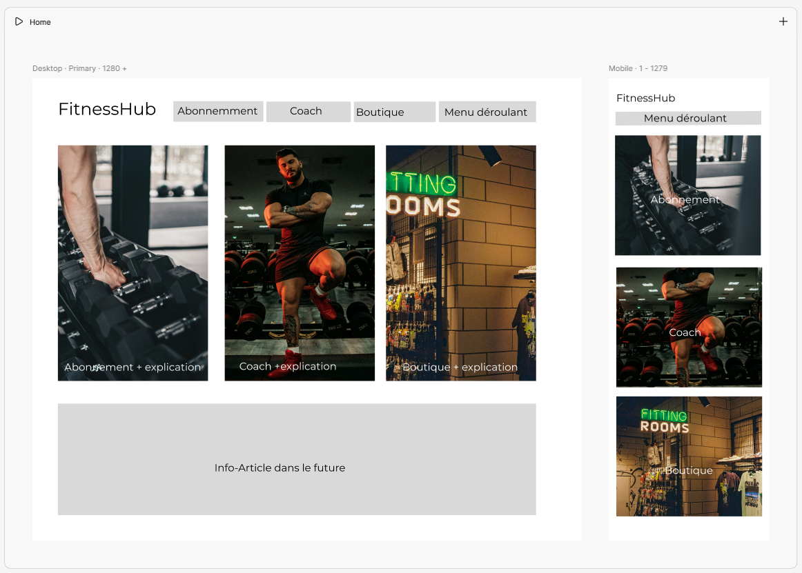
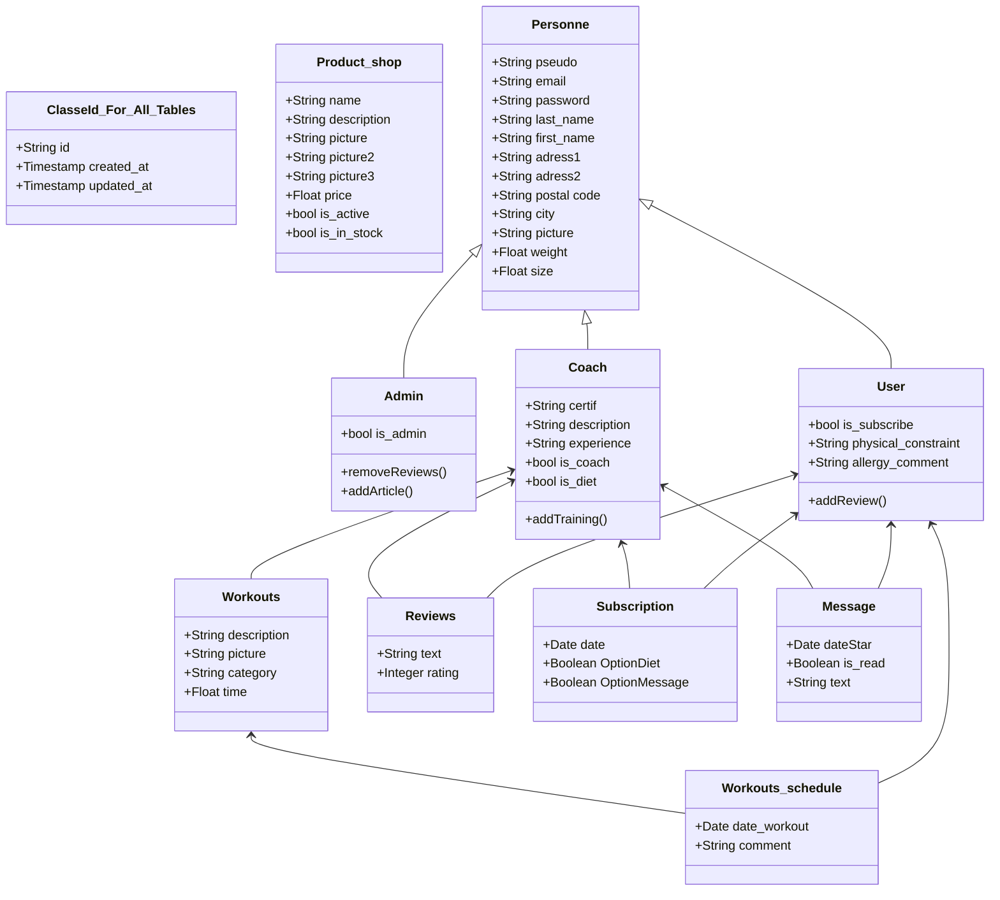

# 0. Define User Stories and Mockups
## User Stories (with MoSCoW Prioritization)

## Client

### Must Have
- As a client, I want to create my account, so I can follow trainings
- As a client, I want to book a coaching session, so I can get personalized guidance
- As a client, I want to connect to my account, so I can choose a coach

### Should Have
- As a client, I want to track my stats, so I can measure my progress.
- As a client, I want to receive notifications before a training, so I don’t forget

### Could Have
- As a client, I want to access exercise videos, so that I can do the right movements

### Won’t Have
- As a client, I want to sync my data with my Apple Watch, so that I can integrate my workouts

## Coach
### Must Have
- As a coach, I want to create an account, so I can post my profile on the platform
- As a coach, I want to log in, so I can update my profile
- As a coach, I want to log in, so I can check the profile of my clients and give personalized guidance
- As a coach, I want to manage my availability, so my clients can book a slot

### Should Have
- As a coach, I want to see my reviews, so I can improve myself

### Could Have
- As a coach, I want to share pre-established nutrition plans, so I can save time

### Won’t Have
- As a coach, I want to receive notifications on my smartwatch, so I don’t miss messages

## Admin
### Must Have
- As an admin, I want to manage user accounts, so I can help coaches and clients with their login problems.
- As an admin, I want to see how many people register on the platform, so I can manage the flow.

### Should Have
- As an admin, I want to generate reports, so I can track platform growth.

### Could Have
- As an admin, I want to configure/add discount codes, so I can attract more users

### First wireframes

# 1. Design System Architecture: 
### FitnessHub MVP Architecture

**Front-end (Client side)**
- Built with HTML, CSS, JavaScript
- Provides UI for login, booking, workouts, nutrition, progress, and chat
- Sends requests to the back-end via HTTP (REST API calls)

**Back-end (Server side)**
- Developed with Python (Flask or Django)
- Handles authentication, business logic, user management, workouts, chat
- Connects with database for storing/retrieving data

**Database**
- SQLite (lightweight, good for MVP)
- Stores users, coaches, workouts, nutrition plans, progress, messages

### Data Flow
- User interacts with the front-end (HTML/CSS/JS).
- The front-end makes an HTTP request to the Python back-end.
- Example: POST /api/v1/users/login
- The back-end processes the request and queries SQLite.
- SQLite returns data (e.g., user profile, progress).
- Python back-end formats response into JSON and sends it back.
- Front-end updates the UI for the user.

# 2. Define Components, Classes, and Database Design  

ClasseId_For_All_Tables is the parent of Product_shop, Personne, Exercice, Exercise_schedule, Reviews, Subscription, Message

# 3. Create High-Level Sequence Diagrams

1. User Authentification

2. Update profile

3. Book a coach

 and responses (outputs) for each module, including:
### Users API

| **Action**            | **Endpoint**               | **Method** | **Input**                                                                                                         | **Output**                                                                                                                                                                             |
| --------------------- | -------------------------- | ---------- | ----------------------------------------------------------------------------------------------------------------- | -------------------------------------------------------------------------------------------------------------------------------------------------------------------------------------- |
| **Get All Users**     | `/api/v1/users`            | GET        | *(none)*                                                                                                          | `json { "users": [ { "id": 1, "name": "Seb Salgue", "role": "coach", "email": "seb@example.com" }, { "id": 2, "name": "Elhadj", "role": "diet", "email": "elhadj@example.com" } ] } ` |
| **Get User by ID**    | `/api/v1/users/{user_id}`  | GET        | `user_id` (URL param)                                                                                             | `json { "id": 1, "name": "Seb Salgue", "role": "coach", "email": "seb@example.com" } `                                                                                                  |
| **Get Users by Role** | `/api/v1/users?role=coach` | GET        | `role` (query param)                                                                                              | `json { "users": [ { "id": 1, "name": "Seb Salgue", "role": "coach" } ] } `                                                                                                              |
| **Create User**       | `/api/v1/users`            | POST       | `json { "name": "Evgen", "email": "evgen@example.com", "password": "securePass123", "role": "simple_user" } ` | `json { "message": "User created successfully", "user": { "id": 3, "name": "Evgen", "role": "simple_user" } } `                                                                   |
| **Update User**       | `/api/v1/users/{user_id}`  | PUT        | `json { "name": "Philips", "role": "coach" } `                                                                 | `json { "message": "User updated successfully", "user": { "id": 3, "name": "Philips", "role": "coach" } } `                                                                         |
| **Delete User**       | `/api/v1/users/{user_id}`  | DELETE     | `user_id` (URL param)                                                                                             | `json { "message": "User deleted successfully" } `                                                                                                                                     |

All users are in a table users but they have Boolean/TYPE to specify if there are
-Admin
-Diet
-Coach
-Subscriber
-Simple user register

### Workouts API

| **Action**        | **Endpoint**                    | **Method** | **Input**                                                                                      | **Output**                                                                                               |
| ----------------- | ------------------------------- | ---------- | ---------------------------------------------------------------------------------------------- | -------------------------------------------------------------------------------------------------------- |
| Get All Workouts  | `/api/v1/workouts`              | GET        | *(none)*                                                                                       | `json { "workouts": [ { "id": 1, "title": "Full Body", "duration": 45 } ] } `                            |
| Get Workout by ID | `/api/v1/workouts/{workout_id}` | GET        | `workout_id` (URL param)                                                                       | `json { "id": 1, "title": "Full Body", "duration": 45 } `                                                |
| Create Workout    | `/api/v1/workouts`              | POST       | `json { "title": "Cardio Blast", "duration": 30, "exercises": ["jumping jacks", "burpees"] } ` | `json { "message": "Workout created successfully", "workout": { "id": 2, "title": "Cardio" } } `   |
| Update Workout    | `/api/v1/workouts/{workout_id}` | PUT        | `json { "title": "Cardio Extreme", "duration": 40 } `                                          | `json { "message": "Workout updated successfully", "workout": { "id": 2, "title": "Cardio Extreme" } } ` |
| Delete Workout    | `/api/v1/workouts/{workout_id}` | DELETE     | `workout_id` (URL param)                                                                       | `json { "message": "Workout deleted successfully" } `                                                    |

### Nutrition Plans API

| **Action**              | **Endpoint**                  | **Method** | **Input**                                                                                           | **Output**                                                                                                      |
| ----------------------- | ----------------------------- | ---------- | --------------------------------------------------------------------------------------------------- | --------------------------------------------------------------------------------------------------------------- |
| Get All Nutrition Plans | `/api/v1/nutrition`           | GET        | *(none)*                                                                                            | `json { "plans": [ { "id": 1, "title": "Weight Loss Plan", "calories": 2000 } ] } `                             |
| Get Plan by ID          | `/api/v1/nutrition/{plan_id}` | GET        | `plan_id` (URL param)                                                                               | `json { "id": 1, "title": "Weight Loss Plan", "calories": 2000 } `                                              |
| Create Plan             | `/api/v1/nutrition`           | POST       | `json { "title": "Muscle Gain Plan", "calories": 2800, "meals": ["chicken", "rice", "broccoli"] } ` | `json { "message": "Nutrition plan created successfully", "plan": { "id": 2, "title": "Muscle Gain Plan" } } `  |
| Update Plan             | `/api/v1/nutrition/{plan_id}` | PUT        | `json { "title": "Updated Gain Plan", "calories": 3000 } `                                          | `json { "message": "Nutrition plan updated successfully", "plan": { "id": 2, "title": "Updated Gain Plan" } } ` |
| Delete Plan             | `/api/v1/nutrition/{plan_id}` | DELETE     | `plan_id` (URL param)                                                                               | `json { "message": "Nutrition plan deleted successfully" } `                                                    |
### Chat API (Coach - Client)

| **Action**     | **Endpoint**                     | **Method** | **Input**                                                                   | **Output**                                                                                                                               |
| -------------- | -------------------------------- | ---------- | --------------------------------------------------------------------------- | ---------------------------------------------------------------------------------------------------------------------------------------- |
| Get Messages   | `/api/v1/chat/{conversation_id}` | GET        | `conversation_id` (URL param)                                               | `json { "conversation_id": 1, "messages": [ { "sender": "coach", "text": "Great job today!", "timestamp": "2025-09-25T12:00:00Z" } ] } ` |
| Send Message   | `/api/v1/chat`                   | POST       | `json { "conversation_id": 1, "sender": "user", "text": "Thanks coach!" } ` | `json { "message": "Message sent", "chat": { "id": 10, "sender": "user", "text": "Thanks coach!" } } `                                   |
| Delete Message | `/api/v1/chat/{message_id}`      | DELETE     | `message_id` (URL param)                                                    | `json { "message": "Message deleted successfully" } `                                                                                    |

# 5. Plan SCM and QA Strategies
### SCM (Source Code Management) Strategy
**Tool: Git (hosted on GitHub)**
- Branching Strategy:
- ``main`` - stable code only (production-ready)
- ``dev`` - integration branch for tested features
- ``feature`` - one branch per feature (e.g., feature/login)
### Workflow:
- Developers create feature branches
- Submit Pull Requests reviewed by another team member
- Merge into dev once validated
- After testing, merge dev into main

### Commit Rules: 
- Small, frequent commits with clear messages

### QA (Quality Assurance) Strategy
**Testing Types:**
- Unit Tests - test individual functions (e.g., user authentication)
- Integration Tests - ensure database & API work together
- Manual Tests → check UI/UX flows (booking, login, progress tracking)

**Testing Tools:**
-Pycodestyle (for Python back-end unit & integration tests)
-Postman (API testing)
