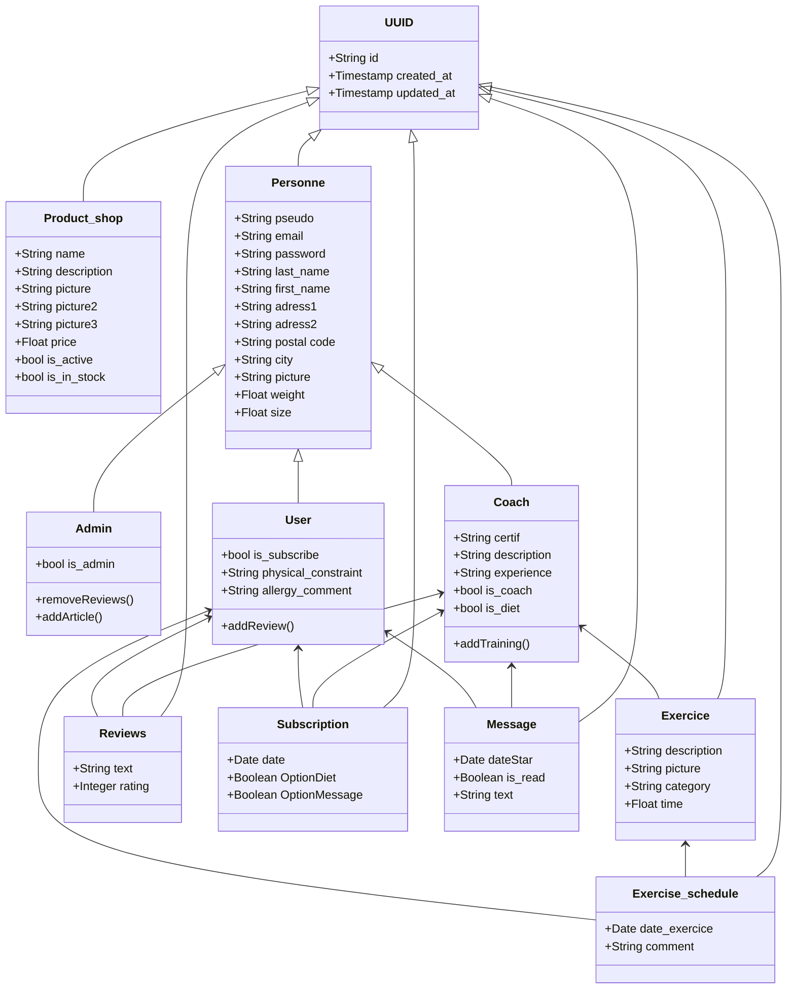

# Class Diagram

```mermaid
classDiagram
direction TB
	class UUID {
		+String id
		+Timestamp created_at
		+Timestamp updated_at
	}

    class Product_shop {
      +String name
      +String description
      +String picture
	    +String picture2
	    +String picture3
	    +Float price
	    +bool is_active
	    +bool is_in_stock
    }

    class Personne {
      +String pseudo
      +String email
      +String password
	    +String last_name
	    +String first_name
	    +String adress1
	    +String adress2
	    +String postal code
	    +String city
      +String picture
      +Float weight
      +Float size
    }


    class Exercice {
      +String description
      +String picture
      +String category<Arms,Legs,Back,...>
      +Float time
    }

    class Exercise_schedule {
      +Date date_exercice
      +String comment
    }


    class Admin {
	    +bool is_admin
	    +removeReviews()
      +addArticle()
    }

    class User {
	    +bool is_subscribe
      +String physical_constraint
      +String allergy_comment
	    +addReview()
    }

    class Coach {
	    +String certif
	    +String description
	    +String experience
	    +bool is_coach
	    +bool is_diet
	    +addTraining()
    }

    class Reviews {
	    +String text
	    +Integer rating
    }

    class Subscription {
	    +Date date
	    +Boolean OptionDiet
	    +Boolean OptionMessage
    }

    class Message {
	    +Date dateStar
	    +Boolean is_read
	    +String text
    }
	UUID <|-- Product_shop
	UUID <|-- Personne
	UUID <|-- Exercise_schedule
	UUID <|-- Exercice
	UUID <|-- Subscription
	UUID <|-- Message
	UUID <|-- Reviews
    Exercice <-- Exercise_schedule
    User <-- Exercise_schedule
    Coach <-- Exercice
    Personne <|-- Admin
    Personne <|-- User
    Coach <-- Reviews
    User <-- Reviews
    Coach <-- Subscription
    User <-- Subscription
    Coach <-- Message
    User <-- Message
    Personne <|-- Coach


```

# Architecture : 
- Front-end: CSS, JS, HTML
- Back-end: Python
- Database: sqlite 
