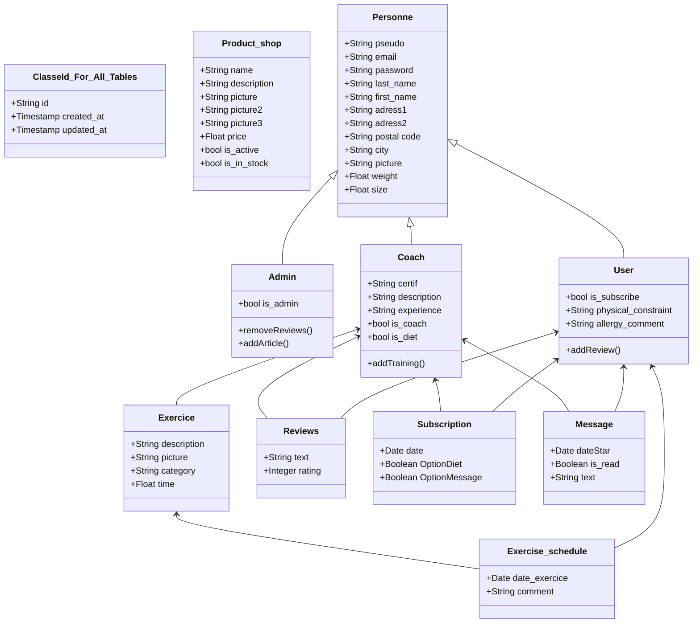

# 2. Define Components, Classes, and Database Design  

ClasseId_For_All_Tables is the parent of Product_shop, Personne, Exercice, Exercise_schedule, Reviews, Subscription, Message

# 1. Design System Architecture: 
- Front-end: CSS, JS, HTML
- Back-end: Python
- Database: sqlite

  # 4. Document External and Internal APIs

| Action         | REST API Endpoint                   |
| -------------- | ----------------------------------- |
| GET USER       | GET `/api/v1/users`                 | 
| GET USER<TYPE> | GET `/api/v1/users/admin`           | 
| GET USER<TYPE> | GET `/api/v1/users/diet`            | 
| GET USER<TYPE> | GET `/api/v1/users/all_simple_user` | 
| GET USER<TYPE> | GET `/api/v1/users/coach`           | 
| PUT USER       | PUT  `/api/v1/users/{user_id}`      | 
| POST USER      | POST `/api/v1/users`                | 
| DELETE USER    | PUT  `/api/v1/users/{user_id}`      | 
| GET USER       | GET  `/api/v1/users/{user_id}`      | 

All users are in a table users but they have Boolean/TYPE to specify if there are
-Admin
-Diet
-Coach
-Subscriber
-Simple user register

